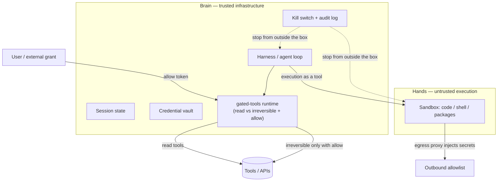

# Architecture layers: brain / hands vs tool-class allows

Two complementary cuts. Do not collapse them.

## Layer A — Brain / hands (sandbox architecture)

From the industry pattern Katelyn Lesse describes in [Secure agents: architecture and sandboxing](https://x.com/katelyn_lesse/status/2099315903884415400):

- Harness, session state, and credentials live **outside** the sandbox.
- The sandbox is a tool for execution, not where the agent “is.”
- Egress proxy injects secrets; the box never holds the real keys.
- Kill switch and logs live outside the thing you might need to kill.
- Sandbox config: strong isolation (prefer microVM / user-space kernel over plain containers), ephemeral, default-deny egress, monitor from outside.

This layer answers: *where can untrusted code and injected text run, and can they touch secrets or the kill path?*

## Layer B — Tool-class allows (`gated-tools`)

This repo. Irreversible tool calls need an **explicit allow from outside the model** (and outside the helpful agent plan). Classification at registration; enforcement in the runtime.

This layer answers: *even on trusted infrastructure, which side effects may fire without an external grant?*

## How they nest

1. Brain/hands keeps secrets and the kill switch off the untrusted box.
2. `gated-tools` sits on the brain: the harness still cannot `send` / `delete` / `pay` unless an allow arrives from outside the model.
3. A sandbox without tool-class allows can still take irreversible actions the model was talked into — if those tools are attached to the brain with open permissions.
4. Tool-class allows without brain/hands still leave credentials and the kill switch co-located with injection surface if you shove the whole agent in a box.

v1 of this repo implements Layer B only. Layer A is documented here so the trail shows judgment about the full stack without pretending we shipped Firecracker.

## What we will not do in this repo

- Ship a sandbox runtime, egress proxy, or vault product.
- Claim container isolation from a TypeScript allow gate.
- Replace brain/hands with more prompt text.
